# Project-Portfolio-3
 
# Ultra Street Fighter 4 damage calculator

**Street Fighter 4** is a game that released in 2008 in arcades to worldwide positive acclaim and ushered in a new era of growth and interest in the entire genre of fighting games which persists to this day.

It's final version, **Ultra Street Fighter 4**, released on Arcade machines, the Xbox 360 and the Playstation 3 in 2014, and remains a fan favourite to this day.

The core of the game play revolves around damaging your opponent to deplete their health (sometimes referred to as HP or Health Points).

_Health being depleted_

There are only two win conditions:
1. Deal enough damage to fully deplete your opponents health

_This one is surprisingly easy to calculate_
 
2. There is a time limit per round. If nobody has had their health fully depleted when the time runs out, whoever has a higher percentage of their total health remaining wins. _Most_ of the time this means whoever deals the most damage wins.

_Left side Ryu has slightly more health than Right side Ryu_

Despite the fact that **damage** is absolutely key to every win condition in the game, there are no calculators online or on the mobile app stores to allow players to work out how much total damage a particular combination of attacks (or "combo") would do. Having such a thing would help players to optimise what they do when they're not playing.

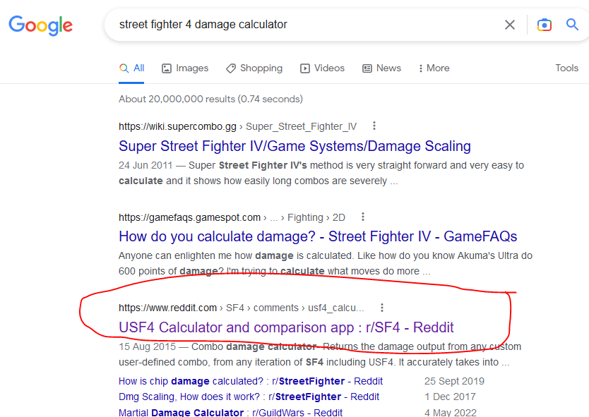
_On first search, only one calculator app shows up in the search results_

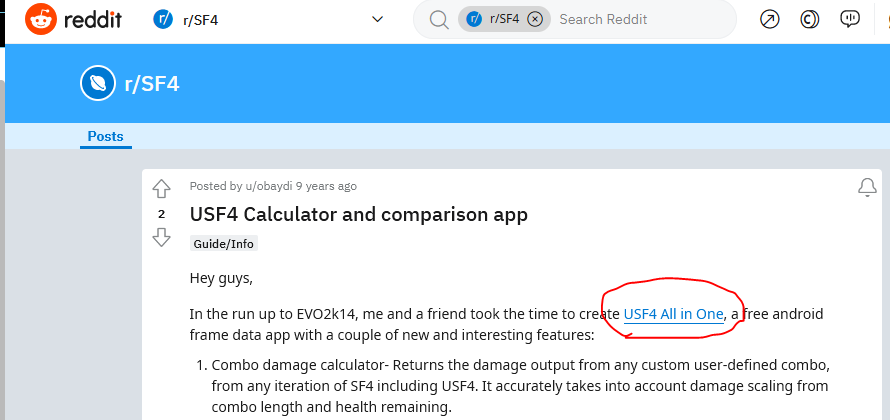
_This leads to a reddit topic, which points to a google play store link_

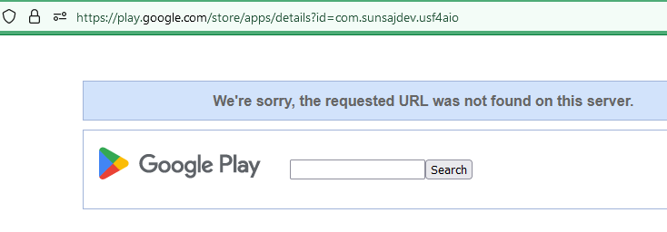
_This link is dead_

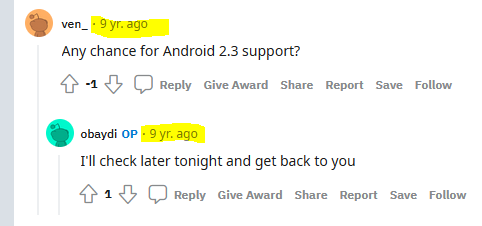
_Last developer comment was 9 years ago (2014 at time of writing). It is safe to assume the project is dead_

A calculator still has value even when playing the game today, because health values are obfuscated behind a graphical **"HP bar"** which, as it depletes, decreases in length and changes from yellow to red. Excluding when players have 100% health, and 0% health (when they are defeated), players can never actually know exactly how much health they currently have.

_A full length health bar usually represents 1000 health. Ryu probably has 850 health remaining. Abel maybe has 300? Even within the game it's not very clear_

## Features
---

## Existing features

## Future features

## Design
---
Code Logic on Paper

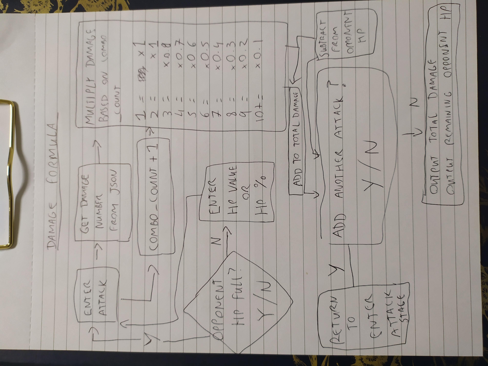

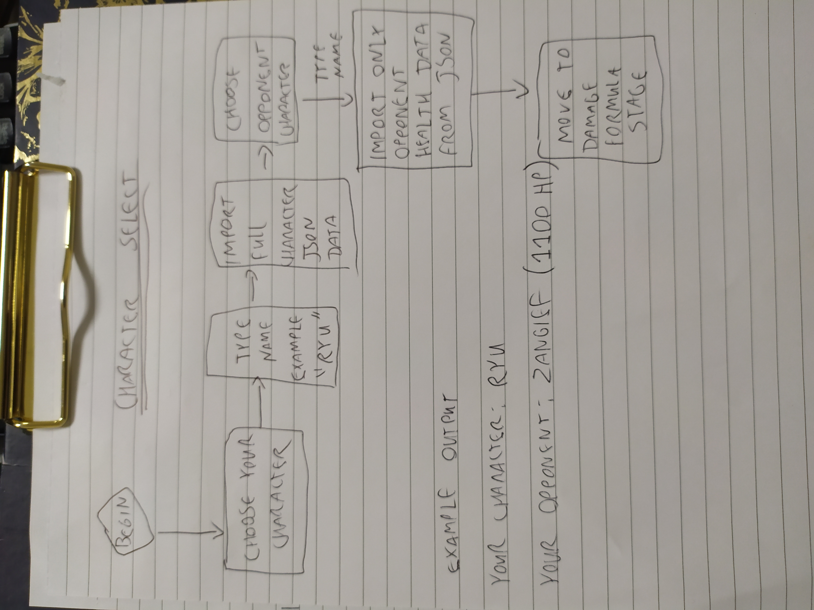

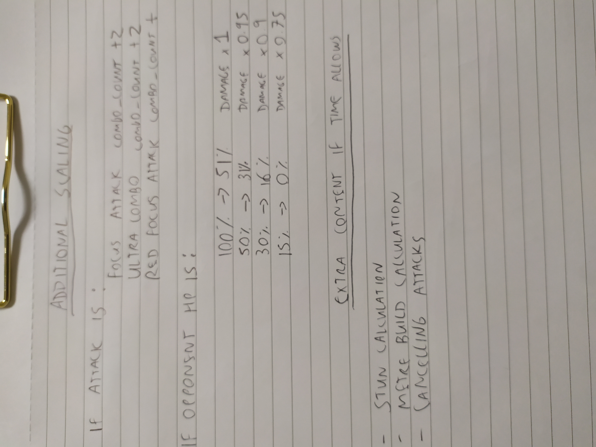

Note that for "Red Focus Attack combo_count" the value is left blank. This is due to discovering a reference on a Street Fighter wiki specifically referencing that Red Focus Attacks increase the combo count by 3, but this seemed incorrect. This will be further referenced in the coding section, but paper calculation was left blank until this value could be confirmed.

### Data Formatting

#### Damage

Data from the json files looks as follows
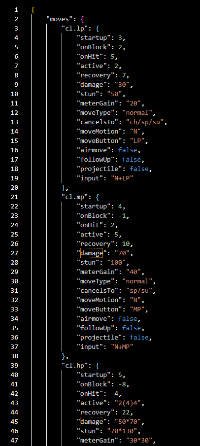

The damage numbers are displayed as such:

**"damage": "60x5*173",**

But for convenience it would better if they were displayed as such:

**"damage": [60,60,60,60,60,173]**

Some damage is represented bafflingly confusingly

**"damage": "270\*38x4\*50x3[270*233]"**

At the start of the project, before tackling the full dataset of all json files for all characters, a more simplified dataset was created by hand of just the damage numbers, of just the characters Ryu, Deejay and Chun-Li.

These files are called **RyuList.json**, **DeejayList.json** and **Chun-LiList.json**

To expedite the testing of this function, the names of the attacks were shortened down from their technically correct names to community slang words

For example: The attack **"Hurrican Kick"** is shortened to what the character shouts when the attack is performed, which is **"tatsu"**

Also to simplify user input error checking later, all string characters will be changed to lowercase

Additionally for one of the attacks **"Shoryuken lp/mp FADC"** the damage value was listed as **[0]**. Without going into too much detail, **"FADC"** is community shorthand for cancelling an attack on the first hit and ignoring the remaining hits.
For example: an attack of **[40, 50, 60]**; if **"FADC"d**; would be **[40]** only

Since the damage values of **"Shoryuken lp"** and **"Shoryuken mp"** are listed as **[100]** and **[80,50]** respectively, there is no scenario where performing **"Shoryuken lp/mp FADC"** would return the same value for either, nor return a value of **[0]**

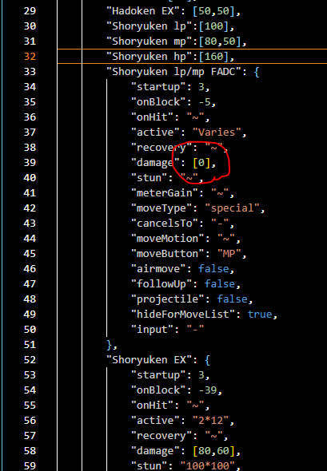

From this it must be concluded that this value is incorrect, so it was removed altogether.

This was confirmed when normalising the data for **Deejay**, where the **FADC** entry for **"Double Rolling Sobat mk"** (simplified to **"sobat mk"**) is listed as **[60]**, which is the correct value when taking only the first damage number from the previous entry of **[60,50]**

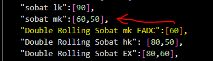
_Even though this value is correct, it was still removed. Since how FADC values are derived are consistent across all characters and moves, this has the potential to be universally automated at the code level. Therefore individual values referencing it are redundant_

Further complications emerged when normalising the damage data for **Chun-Li**'s attacks, where a value of **N** is presented, but never defined

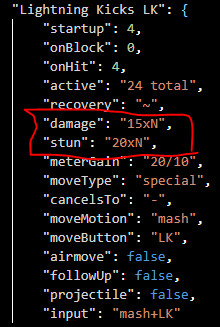

Since the method for performing the attack is to rapidly hit the same button as quickly as possible, it could have been assumed that **N** would directly equal the number of button presses by the user. Even if this were assumed to be the case, this attack could not be implemented in the project without at least knowing the minimum and maximum values of **N**.

_Visually this attack is a rapid series of kicks_

In doing additional research on this point, a value was listed on the **[Supercombo Wiki](https://wiki.supercombo.gg/w/Ultra_Street_Fighter_IV/Chun-Li)** for the total **length** in time (not damage) for the attack. Here the standalone numbers (highlighted yellow) are the individual hits, and the numbers in parenthesis are the pauses between the hits.

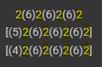

Also the usage of square brackets [ ] in the data is stylistically used to represent one event with multiple different possible outcomes.

By counting these yellow numbers, with consideration for the contexual meaning of square brackets; it seems clear that **N** can either be **4** or **8** or **12**.

Requesting the value for **N** from the user would presume a lot of mechanical knowledge on their behalf, so instead of representing this attack as one action with three possible outcomes, it will instead be represented as three different attacks.

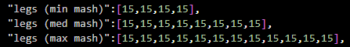
_"Mash" being community shorthand for pressing buttons as quickly as possible_

Once finalised, the dictionary of strings for keys and lists for damage values looks as follows:
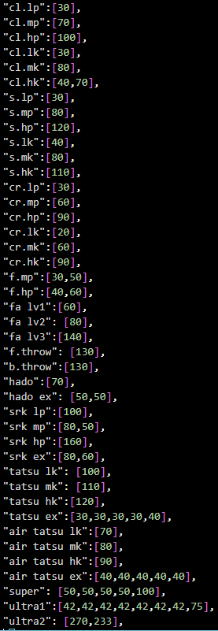
_Ryu's data_

#### Health

There are 44 different characters to choose from, each with a different amount of health, which will affect the damage calculation differently.
But there are only 6 different possible HP totals, which are 850, 1100 and all the increments of 50 in-between.
So for simplicity the health values have been recorded in a dictionary with the amount as the key, and the names as a list of values.

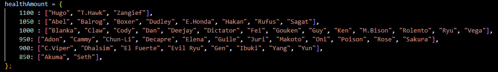

There are 47 names here, as the names of **Balrog, M.Bison** and **Vega** are assigned to different characters in the English and Japanese version of the game.
So including their territory agnostic community monikers of **Boxer, Dictator** and **Claw** adds future-proofing in the event of the application being run by Japanese users.

## Coding

One of the main two formulas used when calculating the damage inflicted is known as damaging scaling i.e. The more successive attacks that occur, the less and less damage they do. The exact formula is shown here as taken from the **[Supercombo Wiki](https://wiki.supercombo.gg/w/Ultra_Street_Fighter_IV/Game_Systems)**, but has been tested independently in the game for verification purposes.

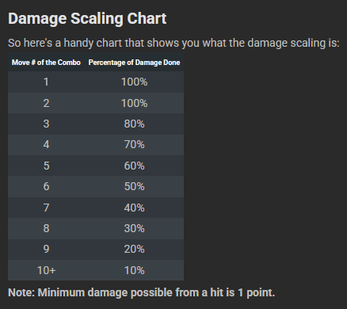

To represent this in the code, two global variable were declared:
- 1.0 was declared as damageScaling to represent this scaling
- 0 was declared as comboCount to represent the number of actions taken thusfar by the user

A while loop was used to continuously ask for user input, and increment the combo count by 1 for each input received.

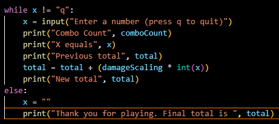
_The damagingScaling variable doesn't yet affect this calculation as it will always be 1_

Then an if loop was used which begins at checking if the combo is already above or equal to 10 hits to apply the maximum scaling; then incrementally checks all the individual scaling values down to 3. It does not check for combo counts of 2 or 1, as those would be unscaled anyway.

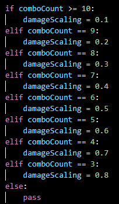

## Testing
---

To test that the initial damage and combo scaling formula work correctly, along with the addition to the total, this is the terminal output from the initial test with liberal printing of the values at each stage

Enter a number (press q to quit)100
Combo Count 1
X equals 100
Previous total 0
New total 100.0
Enter a number (press q to quit)100
Combo Count 2
X equals 100
Previous total 100.0
New total 200.0
Enter a number (press q to quit)100
Combo Count 3
X equals 100
Previous total 200.0
New total 280.0
Enter a number (press q to quit)100
Combo Count 4
X equals 100
Previous total 280.0
New total 350.0
Enter a number (press q to quit)100
Combo Count 5
X equals 100
Previous total 350.0
New total 410.0
Enter a number (press q to quit)100
Combo Count 6
X equals 100
Previous total 410.0
New total 460.0
Enter a number (press q to quit)100
Combo Count 7
X equals 100
Previous total 460.0
New total 500.0
Enter a number (press q to quit)100
Combo Count 8
X equals 100
Previous total 500.0
New total 530.0
Enter a number (press q to quit)100
Combo Count 9
X equals 100
Previous total 530.0
New total 550.0
Enter a number (press q to quit)100
Combo Count 10
X equals 100
Previous total 550.0
New total 560.0
Enter a number (press q to quit)

As can be seen, adding 100 every time produces correct results, in that by 10th 100, it has been scaled down to 10 damage only

So while ten successive 100s in regular maths would produce a result of **1000**; _a combo_ of ten successive 100s in **Street Fighter 4** produces a result of **560**

As wikis are publically editable, this claim is not attributed to any source, but would break from the game convention that all actions advance the combo count by 1, with the two exceptions of Focus Attacks and Ultra Combos which advance the combo count by 2. Nothing anywhere in the code should advance it by 3.

Upon addition research, it was confirmed that **[this wiki information](https://streetfighter.fandom.com/wiki/Damage_Scaling)** **is incorrect** as assumed, but the process of "deconfirming" the information still wasted valuable time.

After this project is completed and graded, this wiki will be edited to reflect the true information for anyone looking into this damage formula in the future.

## References

Ultra Street Fighter 4 Frame Data source #1 by [Vertigo] (https://github.com/vertigo65536/frame-data/tree/master/sf4) (used extensively)

Ultra Street Fighter 4 Frame Data source #2 by [jpgnotgif](https://github.com/jpgnotgif/usf4-frame-data) (not used, but checked in the hopes of better formatted data)

FAT frame data app Github page by [D4rkOnion](https://github.com/D4RKONION/FAT) (not used, but checked)

